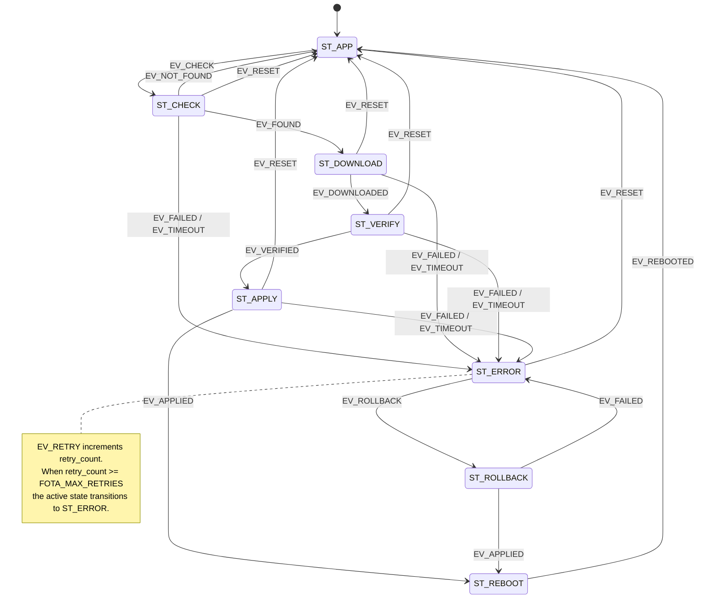

# IoT Firmware Update (FOTA) Manager

## Overview
This project implements a Firmware-Over-The-Air (FOTA) manager for IoT devices
using a **super-loop architecture**, a **circular event queue**, and a
**finite state machine (FSM)**.

The design handles complex multi-step update workflows deterministically
without an RTOS, in pure C99.

---

## Key Concepts
- Circular event queue for decoupled, FIFO event handling
- State-driven firmware update flow with explicit error and rollback states
- Retry logic with a configurable maximum retry count
- Callback hooks for state transitions, errors, and per-state execution
- Semantic versioning support with comparison macros
- No dynamic memory allocation; no RTOS dependency

---

## States

| State         | Description                                              |
|---------------|----------------------------------------------------------|
| `ST_APP`      | Normal application operation (idle / not updating)       |
| `ST_CHECK`    | Querying the update server for a newer version           |
| `ST_DOWNLOAD` | Downloading the firmware image                           |
| `ST_VERIFY`   | Verifying image integrity (SHA-256 hash check)           |
| `ST_APPLY`    | Writing the new image to flash                           |
| `ST_REBOOT`   | Waiting for the device to reboot into the new firmware   |
| `ST_ROLLBACK` | Restoring the previous firmware image from backup        |
| `ST_ERROR`    | Unrecoverable error; awaiting rollback or manual reset   |

---

## Events

| Event          | Description                                               |
|----------------|-----------------------------------------------------------|
| `EV_CHECK`     | Trigger a server-side update availability check           |
| `EV_FOUND`     | Server reports a newer firmware version is available      |
| `EV_NOT_FOUND` | Server confirms firmware is already up-to-date            |
| `EV_DOWNLOADED`| Image download completed successfully                     |
| `EV_VERIFIED`  | Image hash / signature check passed                       |
| `EV_APPLIED`   | Flash write completed successfully                        |
| `EV_REBOOTED`  | Device completed the post-flash reboot cycle              |
| `EV_FAILED`    | Generic failure in the current stage                      |
| `EV_TIMEOUT`   | Stage watchdog expired                                    |
| `EV_ROLLBACK`  | Explicit request to restore the previous image            |
| `EV_RETRY`     | Retry the current stage after a transient fault           |
| `EV_RESET`     | Force FSM back to `ST_APP` unconditionally                |

---

## State Transition Diagram



---

## Public API

### Lifecycle

| Function                  | Description                                        |
|---------------------------|----------------------------------------------------|
| `fota_init()`             | Initialise the manager; reset queue and FSM        |
| `fota_process()`          | Consume one event and advance the FSM (super-loop) |
| `fota_reset()`            | Force FSM to `ST_APP` immediately                  |
| `fota_flush_queue()`      | Discard all pending events from the queue          |

### Event Queue

| Function                    | Description                                      |
|-----------------------------|--------------------------------------------------|
| `fota_enqueue(event)`       | Push an event; returns `FotaError`               |

### State Queries

| Function              | Description                                          |
|-----------------------|------------------------------------------------------|
| `fota_get_state()`    | Return the current `FotaState`                       |
| `fota_is_idle()`      | `true` when state is `ST_APP`                        |
| `fota_has_error()`    | `true` when state is `ST_ERROR`                      |
| `fota_get_status()`   | Fill a `FotaStatus` snapshot struct                  |

### Version & Update Info

| Function                          | Description                                |
|-----------------------------------|--------------------------------------------|
| `fota_set_current_version(v)`     | Store the running firmware version         |
| `fota_set_update_info(info)`      | Store pending update metadata              |
| `fota_get_update_info(info)`      | Retrieve pending update metadata           |

### Callbacks

| Function                        | Description                                    |
|---------------------------------|------------------------------------------------|
| `fota_set_state_change_cb(cb)`  | Hook called on every FSM state transition      |
| `fota_set_error_cb(cb)`         | Hook called when FSM enters `ST_ERROR`         |
| `fota_set_execute_cb(cb)`       | Hook called on every `fota_execute()` tick     |

### String Helpers

| Function                      | Description                                      |
|-------------------------------|--------------------------------------------------|
| `fota_state_to_str(state)`    | Human-readable state name string                 |
| `fota_event_to_str(event)`    | Human-readable event name string                 |
| `fota_error_to_str(error)`    | Human-readable error code string                 |

---

## Configuration

Override these macros before including `fota_manager.h` or via compiler flags:

| Macro               | Default | Description                                         |
|---------------------|---------|-----------------------------------------------------|
| `FOTA_QSIZE`        | `16`    | Event queue capacity (must be a power of two)       |
| `FOTA_MAX_RETRIES`  | `3`     | Max retries before entering `ST_ERROR`              |
| `FOTA_VERSION_LEN`  | `32`    | Max firmware version label string length            |
| `FOTA_URL_LEN`      | `128`   | Max firmware download URL length                    |
| `FOTA_HASH_LEN`     | `65`    | SHA-256 hex digest buffer length (64 chars + `\0`) |

---

## Typical Usage

```c
/* 1. Set running firmware version before init */
FotaVersion v = { .major = 1, .minor = 2, .patch = 0 };
fota_set_current_version(&v);

/* 2. Register callbacks */
fota_set_state_change_cb(my_state_hook);
fota_set_execute_cb(my_platform_hook);

/* 3. Initialise */
fota_init();

/* 4. Super-loop */
while (1) {
    /* Driven by a timer, network event, button, etc. */
    if (time_to_check_update) {
        fota_enqueue(EV_CHECK);
    }

    fota_process();   /* Call every tick */
}
```

When your HTTP client finishes downloading, enqueue `EV_DOWNLOADED`.
When your hash checker passes, enqueue `EV_VERIFIED`. And so on.
On any failure, enqueue `EV_FAILED` — the FSM moves to `ST_ERROR`.
From `ST_ERROR`, enqueue `EV_ROLLBACK` to restore the previous image,
or call `fota_reset()` to return directly to `ST_APP`.

---

## Intended Use
- IoT firmware architecture demos
- Embedded systems education
- Reference design for bare-metal FOTA workflows

